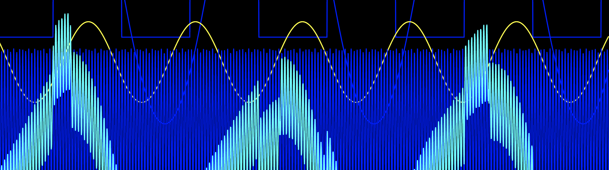

# analogue

Batteries-included musical synthesizer inspired by tide machines with fun visuals and vim bindings.

## visualize 🎧 and hear 👀

If you have [cargo](https://doc.rust-lang.org/cargo/getting-started/installation.html) installed,
clone this repo and run from source with:

`cargo run`

Or download a release from ./releases, unarchive the file, then run it.
You'll start off in an instruction screen and of course there are vim bindings.

> watch out: sound and movement

## build

`cargo build # debug build`

`cargo build --release`

## test

`cargo test`

## release

We use GitHub releases and the workflow in .github/workflows/release.yaml

